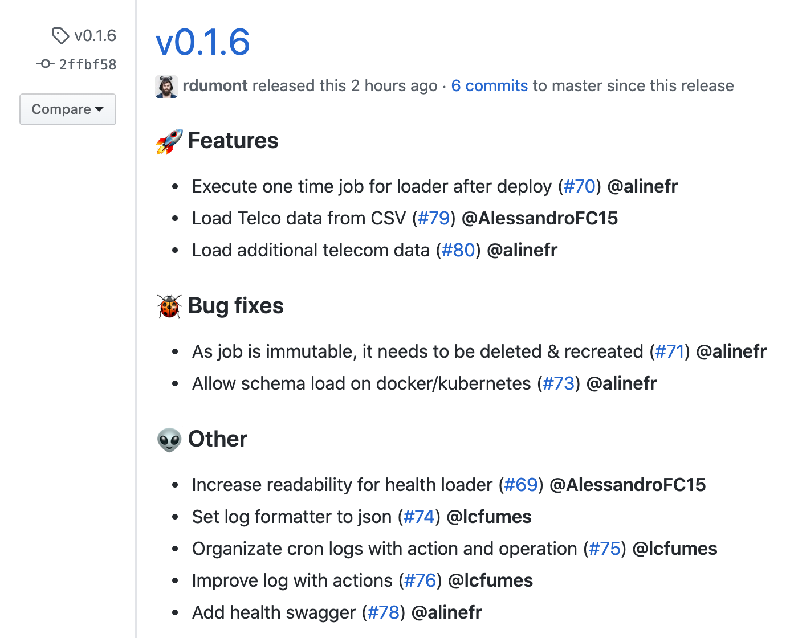

# circleci-gh-conventional-release

[](https://coveralls.io/github/escaletech/circleci-gh-conventional-release?branch=fix/not-found-errors)
[](https://circleci.com/gh/escaletech/circleci-gh-conventional-release)
[](https://circleci.com/orbs/registry/orb/escaletech/gh-conventional-release)

CircleCI Orb to create releases on GitHub based on tags

## Usage

Environment variables used for default parameters:

- `GITHUB_TOKEN`
- `CIRCLE_TAG` (set by default in CircleCI when build is triggered by a tag push)
- `CIRCLE_PROJECT_USERNAME` (set by default in CircleCI)
- `CIRCLE_PROJECT_REPONAME` (set by default in CircleCI)

Assuming an environment with all the required variables, usage consists of simply calling the `create-release` job or command:

```yaml
version: 2.1

orbs:
  gh-release: escaletech/gh-conventional-release@0.1.0

workflows:
  version: 2
  release:
    jobs:
      # ... more jobs
      - gh-release/create-release:
          context: context-with-github-token-env-var
```

But you can always specify parameters individually:

```yaml
version: 2.1

orbs:
  gh-release: escaletech/gh-conventional-release@0.1.0

workflows:
  version: 2
  release:
    jobs:
      # ... more jobs
      - gh-release/create-release:
          github-token: ABCXYZ457 # default is $GITHUB_TOKEN
          target-tag: v0.1.2 # default is $CIRCLE_TAG
          repo-owner: your-username # default is $CIRCLE_PROJECT_USERNAME
          repo-name: your-repo-name # default is $CIRCLE_PROJECT_REPONAME
```

This will result in a GitHub release like the following:


